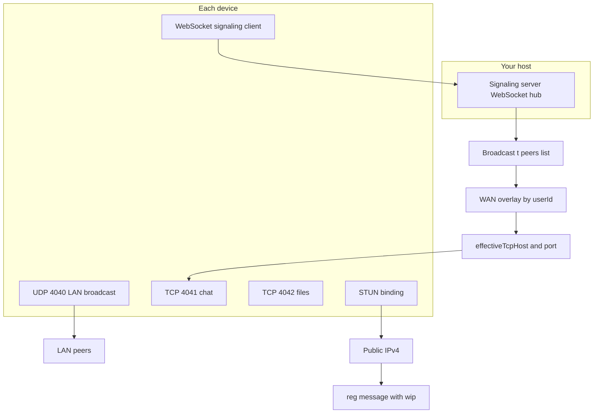

# Local Chat — feature reference (Alpha 1.7.0)

This document maps **user-visible behavior** to **code** so testers and contributors know what is implemented.

---

## Core principles

| Topic | Detail |
|--------|--------|
| Transport | **Default: LAN only** — no internet chat relay. **Optional global mode** adds STUN + a **WebSocket signaling** URL you control (still **no** third-party chat server; same TCP ports as LAN). |
| Discovery | **UDP** broadcast on the LAN; optional **WAN overlay** from signaling + STUN public addresses. |
| Chat | **TCP** JSON messages; one socket per peer session. |
| Files | **Separate TCP** file transfer with chunked I/O and progress. |

---

## Global discovery (WAN)

When **Settings → Global discovery** is on, the app **reuses the same ports and protocols** as LAN-only mode: **UDP 4040** (broadcast), **TCP 4041** (chat), **TCP 4042** (files). Nothing switches chat or files to WebRTC data channels. **STUN** (or **manual public IP**) supplies the **WAN address** (`wip`) for signaling; optional **advertised TCP ports** describe your router’s public mappings.

### End-to-end flow



1. **LAN (unchanged):** Devices listen on UDP 4040 and exchange `LOCALCHAT|userId|name|tcpPort` (and optional LAN tag). When a peer is seen recently on UDP, `PeerDevice.lastSeenOnLan` is set and routing **prefers the LAN IP** for TCP.
2. **STUN and manual public IP:** If **STUN host** is set (default public STUN in settings), the client runs a **binding** request and learns a **server-reflexive** address. That address is sent as `wip` in the **`reg`** message unless **Settings → Manual public IP** is set — then the manual value is used instead of STUN (for CGNAT, wrong STUN, or a static hostname). If both are empty, `wip` is empty — **WAN routing falls back to the peer’s LAN IP (`lip`)**, which is only correct on the same subnet.
3. **Advertised TCP ports (`tp` / `tfp`):** The **`reg`** message includes **`tp`** (chat) and **`tfp`** (files). By default these match the app’s local ports (4041 / 4042). If **Advertised chat/file TCP** in settings is non-zero, those values are sent so peers dial your **router’s public** ports when you use port forwarding like `public 15021 → LAN 4041`.
4. **Signaling:** The client opens **`WebSocket.connect`** to **Signaling WebSocket URL** (scheme `ws://` or `wss://`). URLs with no path are **normalized** to end with `/` (`normalizeSignalingWebSocketUrl` in [`lib/global_signaling.dart`](../lib/global_signaling.dart)). The client sends **`{"t":"reg",...}`** periodically; the server responds with **`{"t":"peers","list":[...]}`** (see [`lib/global_signaling.dart`](../lib/global_signaling.dart) and [`bin/signaling_server.dart`](../bin/signaling_server.dart)).
5. **Merge:** [`DiscoveryService.peers`](../lib/discovery_service.dart) merges LAN entries with the WAN overlay by **`userId`**. WAN fields supply `wanIp`, `wanTcpPort`, and `wanFileTcpPort` when LAN is stale.
6. **Connect:** [`PeerDevice.effectiveTcpHost` / `effectiveTcpPort`](../lib/device.dart) — if LAN was seen within **~45s** via UDP, use **LAN** discovery; otherwise use **`wanIp` / `wanTcpPort`**. Chat uses [`ConnectionService.connectTo`](../lib/connection_service.dart). **Outbound files** use [`PeerDevice.effectiveFileTcpPort`](../lib/device.dart) (LAN → default file port; WAN → `wanFileTcpPort` from `tfp`) in [`TransferManager`](../lib/transfer_manager.dart) / [`FileSender.send`](../lib/file_transfer_service.dart).

### Reference signaling server

Run on a machine reachable by all peers (same LAN or port-forwarded):

```bash
dart run bin/signaling_server.dart
# optional: dart run bin/signaling_server.dart 4576
```

Point the app at **`ws://<host>:<port>/`** (any path works with this server). On connect, the server **pushes the current peer list** so clients do not wait for the next periodic broadcast.

### Port forwarding (WAN)

- On the **peer that must receive** inbound TCP, configure the **router**:
  - Forward **TCP** to that PC’s **LAN** IP: **4041** (chat) and **4042** (files) unless you use rare custom local ports.
  - **UDP 4040** is **not** required on the WAN path (LAN discovery only).
- Remote peers dial the **public IP** and the **`tp` / `tfp`** ports from signaling. If you use **different public ports** on the router (see below), set **Advertised chat/file TCP** on that device to those **public** numbers.
- STUN does not open TCP through NAT; the **receiving** PC must be reachable on the forwarded ports.

### Multiple PCs on the same router

Everyone behind one home router **shares a single public IP**. You **cannot** forward the **same** public TCP ports to two different PCs. So:

| Situation | What to do |
|-----------|------------|
| Only **LAN** / same Wi‑Fi | No port forwarding; UDP discovery handles it. |
| **One** PC should accept **internet** connections | Forward public **4041** and **4042** to **that** PC’s LAN IP. Leave **Advertised** at **0** and **Manual public IP** empty if STUN works. |
| **Several** PCs each need **incoming** from the internet | Give **each PC** a **unique pair of external ports** on the router, all targeting **local** 4041/4042 on the right machine. Example: PC1 → forward **15021→4041**, **15022→4042**; PC2 → **15031→4041**, **15032→4042**. On PC1 set **Advertised** chat/file **15021** / **15022**; on PC2 **15031** / **15032**. The app still listens on **4041/4042** locally. |

**Manual public IP:** use your **home’s** public address (or dynamic DNS hostname) — **the same for every device** on that router if you fill it at all. **Do not** put a **192.168.x.x** LAN address here; that is only for the router’s port-forward **target** field. Usually leave **Manual public IP** empty and rely on STUN.

### Automatic port mapping (UPnP)

When **Settings → Automatic port mapping (UPnP)** is on **and** **both** advertised chat and file TCP ports are **0**, the app tries **UPnP IGD** (`NatPortMappingService` in [`lib/nat_port_mapping.dart`](../lib/nat_port_mapping.dart), [`port_forwarder`](https://pub.dev/packages/port_forwarder)) to add NAT rules on the router so inbound WAN TCP reaches this PC. Successful **external** ports are sent in signaling as `tp` / `tfp`.

- **Detection / multiple peers** is unchanged: LAN uses UDP; WAN uses the signaling server list. UPnP does **not** discover peers — it only helps **this** device be reachable.
- **Automatic chat** still means *you open a chat with a peer*; the app does not auto-open conversations. UPnP removes the need for manual forwarding **when** the router supports UPnP and it is enabled.
- If the default external ports are **already mapped** (e.g. another PC on the same router), the client tries **alternate** external port candidates until one succeeds or the list is exhausted.
- If **either** advertised port is non-zero (manual forwarding), UPnP is **not** used — you are in full manual mode for those ports.
- **Carrier NAT / no UPnP / double NAT:** mapping may fail; use manual router rules and advertised ports as before.

### Will it work? (checklist)

| Scenario | Expected result |
|----------|------------------|
| Global off | Same as before: LAN UDP + TCP only; no WebSocket/STUN. |
| Global on, signaling URL empty | WAN overlay cleared; LAN still works. |
| Global on, STUN host empty and no manual IP | No `wip` in `reg`; peers only get private `lip` — **fine on LAN**, **not** for internet. |
| Manual public IP set | Used as `wip` even if STUN fails or is wrong. |
| Advertised ports non-zero | Peers use those as `tp`/`tfp` (match your router’s **public** ports); UPnP is skipped. |
| UPnP on, both advertised 0, router supports UPnP | App may open mappings; `reg` uses mapped external ports. |
| UPnP fails | Falls back to local port numbers in `reg` — you may still need manual forwarding. |
| Global on, STUN OK, signaling OK, both on same LAN | UDP keeps `lastSeenOnLan` fresh → **LAN TCP** used; internet path unused. |
| Global on, remote peer, STUN or manual `wip` OK, **receiver** forwarded | Initiator can open TCP to `wip:tp` and files to `wip:tfp`; **should work**. |
| Global on, remote peer, **no** port forwarding | Inbound TCP to the peer’s public IP **fails** — chat cannot connect. |
| `wss://` with self-signed cert | May fail unless the platform trusts the cert — use `ws://` on trusted LANs or proper TLS. |

### Code map

| Piece | File |
|-------|------|
| Settings (toggle, URL, STUN, manual IP, advertised ports, UPnP) | [`lib/app_settings.dart`](../lib/app_settings.dart), [`lib/settings_screen.dart`](../lib/settings_screen.dart) |
| STUN binding | [`lib/stun_client.dart`](../lib/stun_client.dart) |
| WebSocket + overlay | [`lib/global_signaling.dart`](../lib/global_signaling.dart) |
| LAN + WAN merge | [`lib/discovery_service.dart`](../lib/discovery_service.dart) |
| TCP targets | [`lib/device.dart`](../lib/device.dart) (`effectiveTcp*`, `effectiveFileTcpPort`), [`lib/connection_service.dart`](../lib/connection_service.dart), [`lib/file_transfer_service.dart`](../lib/file_transfer_service.dart), [`lib/transfer_manager.dart`](../lib/transfer_manager.dart) |
| UPnP (optional) | [`lib/nat_port_mapping.dart`](../lib/nat_port_mapping.dart) |
| Lifecycle | [`lib/main.dart`](../lib/main.dart) `GlobalSignalingService.instance.init` / `dispose` |

---

## Home screen

| Feature | Behavior | Code |
|---------|----------|------|
| Peer list | Shows discovered devices; refresh on discovery/connection events. | [`lib/home_screen.dart`](lib/home_screen.dart) |
| Online status | Connects TCP when opening chat; list reflects connection state. | [`lib/connection_service.dart`](lib/connection_service.dart), [`lib/discovery_service.dart`](lib/discovery_service.dart) |
| Identity merge | Same physical device after app data clear may **merge** chat history via LAN stable tag. | [`lib/services/device_identity_service.dart`](lib/services/device_identity_service.dart), [`lib/message_store.dart`](lib/message_store.dart) `mergePeerLanIdentity` |

---

## Chat screen

| Feature | Behavior | Code |
|---------|----------|------|
| Text messages | Multiline composer; Enter sends on desktop (hardware handler); encrypted when connected. | [`lib/chat_screen.dart`](lib/chat_screen.dart), [`lib/chat_crypto.dart`](lib/chat_crypto.dart) |
| Delivery states | Sent / confirming / delivered / undelivered (TCP). | [`lib/message_model.dart`](lib/message_model.dart), store |
| History | SQLite-backed; initial window + scroll-up pagination. | [`lib/message_store.dart`](lib/message_store.dart), [`lib/chat_screen.dart`](lib/chat_screen.dart) |
| Attachments | Stage files; **Send** sends all staged; optional caption text. | [`lib/chat_screen.dart`](lib/chat_screen.dart), [`lib/transfer_manager.dart`](lib/transfer_manager.dart) |
| Images in bubbles | Thumbnails; tap to open; **outbound** files copied to persistent storage so paths survive after send. | [`lib/transfer_manager.dart`](lib/transfer_manager.dart) |
| File transfer UI | Progress, pause/cancel, failed/cancelled styling. | [`lib/chat_screen.dart`](lib/chat_screen.dart), [`lib/transfer_manager.dart`](lib/transfer_manager.dart) |
| Copy message | Long-press / context menu; copy path or image bytes to clipboard. | [`lib/chat_screen.dart`](lib/chat_screen.dart) |
| Desktop | Drag-and-drop onto composer strip; **View in Explorer** when file missing opens configured download folder. | [`lib/chat_screen.dart`](lib/chat_screen.dart), [`lib/app_settings.dart`](lib/app_settings.dart) |
| Android | **Locate file** opens folder via Documents URI; **Share into app** queues staged items; **paste image** from clipboard (long-press composer). | [`MainActivity.kt`](../android/app/src/main/kotlin/com/example/local_chat/MainActivity.kt) |

---

## Attachments pipeline

| Stage | Detail |
|----------|--------|
| Pick | Desktop: `file_picker`, folder → zip at send. Android: native SAF (`content://`) without copy-at-pick for attach; gallery/image picker as paths. |
| Prepare | Content URIs materialized to temp; duplicate paths in one batch copied; folder zipped. | [`lib/transfer_manager.dart`](lib/transfer_manager.dart), [`lib/attachment_prepare.dart`](lib/attachment_prepare.dart) |
| Persist outbound | Temp send paths are copied to **`getApplicationDocumentsDirectory()/outbound_attachments/`** before DB update so cleanup after send does not delete the preview file. | [`lib/transfer_manager.dart`](lib/transfer_manager.dart) |
| Transfer | Chunked send/receive; resume paths on receiver. | [`lib/file_transfer_service.dart`](lib/file_transfer_service.dart) |

---

## Settings

| Feature | Code |
|---------|------|
| Theme | System / light / dark — [`lib/app_settings.dart`](lib/app_settings.dart) |
| Global discovery | WAN toggle, signaling URL, STUN, manual public IP, advertised chat/file TCP, UPnP — [`lib/app_settings.dart`](lib/app_settings.dart), [`lib/settings_screen.dart`](lib/settings_screen.dart); behavior — [Global discovery (WAN)](#global-discovery-wan) |
| Download folder | Default + picker; Android storage probes — [`lib/settings_screen.dart`](lib/settings_screen.dart), [`lib/android_storage_access.dart`](lib/android_storage_access.dart) |
| Android battery | Unrestricted battery hint — [`lib/android_app_control.dart`](lib/android_app_control.dart) |
| Desktop | Run in background, start with Windows (where applicable) — [`lib/app_settings.dart`](lib/app_settings.dart) |
| About | Version (`package_info_plus`), publisher, developer — [`lib/app_metadata.dart`](lib/app_metadata.dart), [`lib/settings_screen.dart`](lib/settings_screen.dart) |

---

## Notifications & tray

| Platform | Behavior |
|----------|----------|
| Android | Local notifications plugin; channels configured in [`lib/main.dart`](lib/main.dart) |
| Windows | Tray icon, minimize to tray, optional close-to-tray — [`lib/main.dart`](lib/main.dart) |

---

## First launch

| Flow | Code |
|------|------|
| Notifications, storage, download folder | [`lib/first_launch_prompt.dart`](lib/first_launch_prompt.dart) |

---

## Tests

| Area | File |
|------|------|
| Attachment prepare helpers | [`test/attachment_prepare_test.dart`](../test/attachment_prepare_test.dart) |

Run: `flutter test`

---

## Snackbars

Centralized top placement (below app bar): [`lib/app_snackbar.dart`](../lib/app_snackbar.dart)
